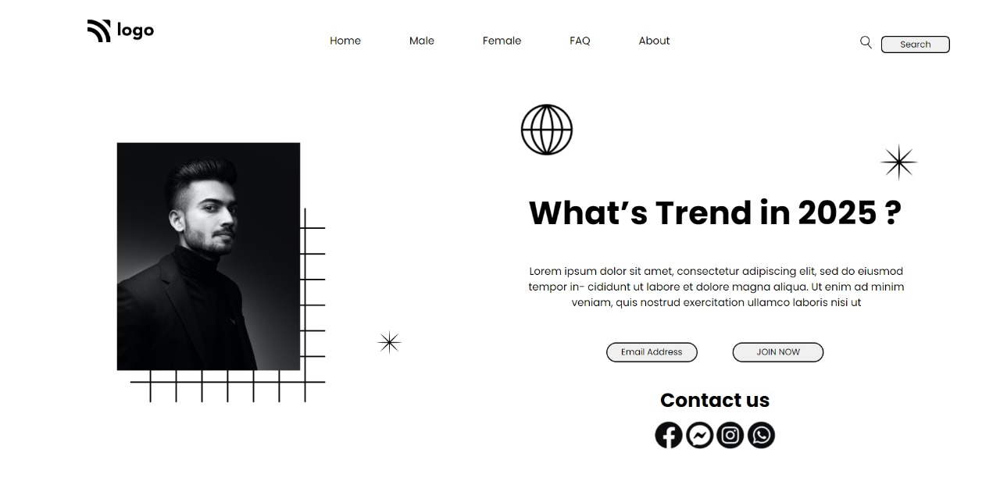

## Hey there ,  I am Amarjeet Kumar 
 I have built a template of HTML and CSS project using my core css skills 
 
 ## Technology Used 
  - ` HTML `
  -  ` CSS `
  -  ` Medai Query `
## About my Project
 - My web page is fully responsive .
- This is my first project of HTML and CSS .
- In this project I have created   a   Home page by using HTML and CSS only.
- During making of this project i learn alot about position .

 
 
## Time spend 
- This is my first project , and I'm new in this field so i spend aprox 5 hour to make this project ready.

## Link of my project .

- [Live Link....](https://project-01-street-style-landing-page.netlify.app/)

## Screenshot of my web page.
 
